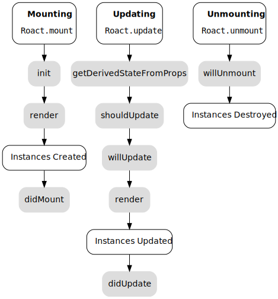

In the previous section, we talked about using components to create reusable chunks of state, and introduced *host*, *function*, and *stateful* components.

Stateful components do everything that function components do, but have the addition of mutable *state* and *lifecycle methods*.

## State
**State** is the term we use to talk about values that are owned by a component itself.

Unlike **props**, which are passed to a component from above, **state** is created within a component and can only be updated by that component.

We can set up the initial state of a stateful component inside of a method named `init`:

```lua
function MyComponent:init()
	self:setState({
		currentTime = 0
	})
end
```

To update state, we use a special method named `setState`. `setState` will merge any values we give it into our state. It will overwrite any existing values, and leave any values we don't specify alone.

There's another form of `setState` we can use. When the new state we want our component to have depends on our current state, like incrementing a value, we use this form:

```lua
-- This is another special method, didMount, that we'll talk about in a moment.
function MyComponent:didMount()
	self:setState(function(state)
		return {
			currentTime = 1 + state.currentTime
		}
	end)
end
```

In this case, we're passing a _function_ to `setState`. This function is called and passed the current state, and returns a new state. It can also return `nil` to abort the state update, which lets Roact make some handy optimizations.

Right now, this version of `setState` works exactly the same way as the version that accepts an object. In the future, Roact will support optimizations that make this difference more important, like [asynchronous rendering](https://github.com/Roblox/roact/issues/18).

## Lifecycle Methods
Stateful components can provide methods to Roact that are called when certain things happen to a component instance.

Lifecycle methods are a great place to send off network requests, measure UI ([with the help of refs](../../advanced/bindings-and-refs#refs)), wrap non-Roact components, and produce other side-effects.

The most useful lifecycle methods are generally `didMount` and `didUpdate`. Most components that do things that are difficult to express in Roact itself will use these lifecycle methods.

Here's a chart of all of the methods available. You can also check out the [Lifecycle Methods](../../api-reference/#lifecycle-methods) section of the API reference for more details.

<div align="center">
	<a href="../../images/lifecycle.svg">
		
	</a>
</div>

## Incrementing Counter, Part Three
Building on the previous two examples, we can expand the incrementing counter to move the counter state and loop inside Roact, and use `setState` to trigger a re-render instead of `Roact.update`.

Generally, this ticking clock demonstrates how many stateful components are structured in Roact.

```lua
local ReplicatedStorage = game:GetService("ReplicatedStorage")
local Players = game:GetService("Players")

local Roact = require(ReplicatedStorage.Roact)

local Clock = Roact.Component:extend("Clock")

function Clock:init()
	-- In init, we can use setState to set up our initial component state.
	self:setState({
		currentTime = 0
	})
end

-- This render function is almost completely unchanged from the first example.
function Clock:render()
	-- As a convention, we'll pull currentTime out of state right away.
	local currentTime = self.state.currentTime

	return Roact.createElement("ScreenGui", {}, {
		TimeLabel = Roact.createElement("TextLabel", {
			Size = UDim2.new(1, 0, 1, 0),
			Text = "Time Elapsed: " .. currentTime
		})
	})
end

-- Set up our loop in didMount, so that it starts running when our
-- component is created.
function Clock:didMount()
	-- Set a value that we can change later to stop our loop
	self.running = true

	-- We don't want to block the main thread, so we spawn a new one!
	spawn(function()
		while self.running do
			-- Because we depend on the previous state, we use the function
			-- variant of setState. This will matter more when Roact gets
			-- asynchronous rendering!
			self:setState(function(state)
				return {
					currentTime = state.currentTime + 1
				}
			end)

			wait(1)
		end
	end)
end

-- Stop the loop in willUnmount, so that our loop terminates when the
-- component is destroyed.
function Clock:willUnmount()
	self.running = false
end

local PlayerGui = Players.LocalPlayer.PlayerGui

-- Create our UI, which now runs on its own!
local handle = Roact.mount(Roact.createElement(Clock), PlayerGui, "Clock UI")

-- Later, we can destroy our UI and disconnect everything correctly.
wait(10)
Roact.unmount(handle)
```